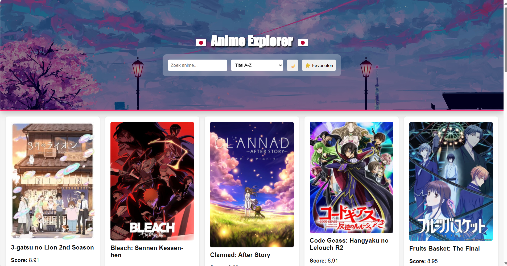
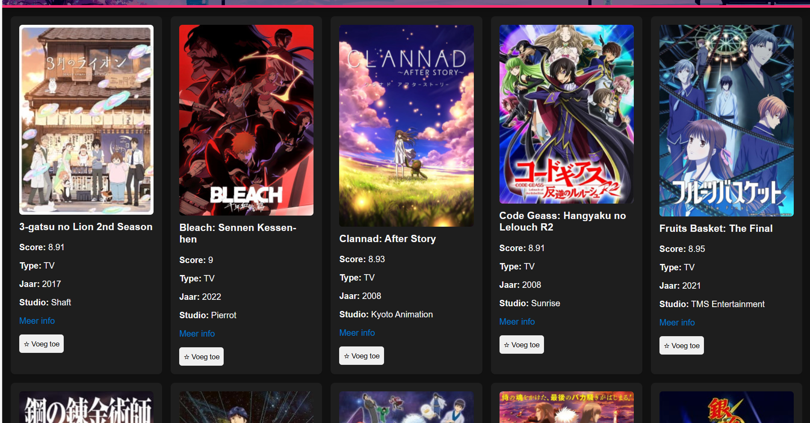
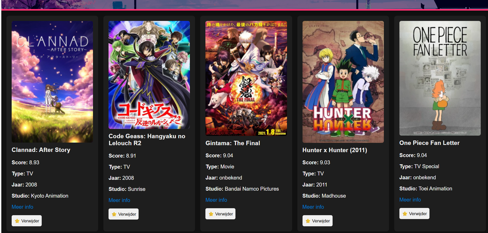
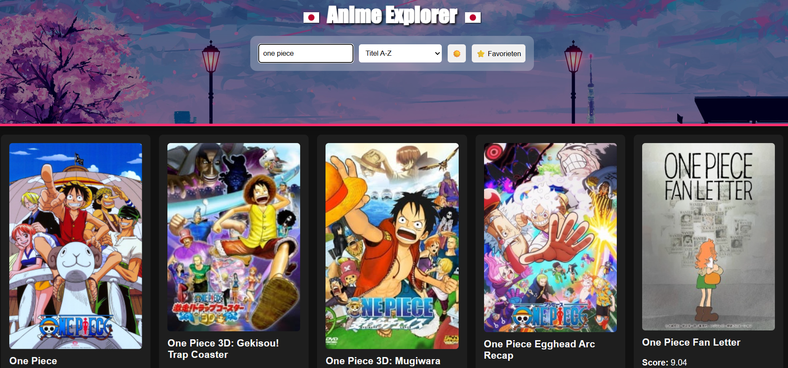

# 🎌 Anime Explorer

Anime Explorer is een interactieve single-page webapplicatie, gemaakt voor het vak **Web Advanced**. De app maakt gebruik van de [Jikan API](https://jikan.moe) en laat gebruikers toe om anime te verkennen, te zoeken, te sorteren en toe te voegen aan hun favorieten.

---

## 📋 Functionaliteiten

- 🔍 Zoek op titel
- ↕️ Sorteer op titel, score of jaar
- ⭐ Favorieten opslaan (blijft bewaard via `localStorage`)
- 🌙 Donker/licht thema (geheugen in localStorage)
- 🖼️ Visuele lijst met 6 kolommen:
  - Afbeelding
  - Titel
  - Score
  - Type
  - Jaar
  - Studio
- 📱 Responsive design (Flexbox/Grid)

---

## 🔌 Gebruikte API

**Jikan API** – publieke anime-API gebaseerd op MyAnimeList  
- Endpoint:  
  `https://api.jikan.moe/v4/anime?order_by=score&sort=desc&limit=20`

---

## ⚙️ Gebruikte technieken

| Techniek / concept                      | Toepassing in project             |
|----------------------------------------|-----------------------------------|
| DOM manipulatie                        | `renderList()` in `main.js`       |
| Events (click/input/change)            | Knoppen, zoekveld, filters        |
| Template literals                      | HTML renderen met backticks       |
| `fetch`, `async/await`, JSON           | API-data ophalen en verwerken     |
| Array methods: `map`, `filter`, `sort` | Filteren/sorteren van anime-data  |
| Conditional operator (`??`)            | Fallbacks bij lege waarden        |
| `localStorage`                         | Opslaan van thema + favorieten    |
| Modules en imports                     | Gescheiden JS via Vite            |
| CSS Grid & Flexbox                     | Layout van kaarten + responsive   |
| Icons en visuals                       | Emojis + vlaggen in header        |
| Project opzet met Vite                 | `npm run dev`, `build`, `preview` |

---

## 🛠 Installatiehandleiding

1. Clone dit project
```bash
git clone https://github.com/marwan/Anime-Explorer.git
cd my-project
```

2. Installeer dependencies
```bash
npm install
```

3. Start de dev server
```bash
npm run dev
```

4. Builden voor productie
```bash
npm run build
npm run preview
```

---

## 📸 Screenshots

### 🏠 Homepage


### 🌙 Donkere modus


### ⭐ Favorieten geselecteerd


### 🔍 Zoekopdracht actief


---

## 📁 Projectstructuur

```
my-project/
├── index.html
├── package.json
├── package-lock.json
├── public/
├── src/
│   ├── main.js
│   ├── style.css
├── image/
│   ├── homePage.png
│   ├── darkmode.png
│   ├── favorieten.png
│   ├── zoekopdracht.png
├── .gitignore
├── README.md
```

---

## 📦 Commit geschiedenis

- ✅ Initial commit  
- ✅ vite en html basis  
- ✅ Create README.md  
- ✅ heel mijn opdracht  
- ✅ header stylen  
- ✅ titel  
- ✅ maan verandert naar zon  
- ✅ Update style.css  
- ✅ header en vite inorde gebracht  
- ✅ Merge met GitHub hoofdrepo  
- ✅ 📸 screenshots toegevoegd  

---

## 📚 Gebruikte bronnen

- [Jikan API Docs](https://docs.api.jikan.moe/)  
  Gebruikt voor het ophalen van anime data (titel, score, studio, jaar, afbeelding...)

- [Vite.js – Next Generation Frontend Tooling](https://vitejs.dev/)  
  Build tool en dev server voor het opzetten van het project

- [MDN Web Docs (Mozilla)](https://developer.mozilla.org/)  
  Voor documentatie over `fetch`, `localStorage`, `map()`, `filter()` en andere JS-methodes

- [Unsplash](https://unsplash.com)  
  Voor inspiratie en fallback achtergronden in de header

- [Wallpapercave – Anime Wallpapers](https://wallpapercave.com/)  
  Gebruikt voor de achtergrondafbeelding in de header

- [Emojipedia](https://emojipedia.org/)  
  Voor het gebruiken van vlaggetjes, sterren en maan icoontjes

- [Flexbox Froggy](https://flexboxfroggy.com/) & [CSS Grid Garden](https://cssgridgarden.com/)  
  Voor het oefenen van layout technieken tijdens de ontwikkeling

  - [ChatGPT – OpenAI](https://chatgpt.com/c/682ef030-13a4-800e-a476-9c5c1bee85b4)  
  Gebruikt voor hulp bij:
  - voor het verbeteren van mijn code
  - readme tekst maken

- [ChatGPT – README Generator](https://chatgpt.com/c/682a22d1-e880-800e-affa-567fe125c890)  
  zoeken van een API en uitleggen van mijn opdracht

---
## 👤 Auteur

**Naam:** Marwan Amakran  
**Klas:** 1TI  
**School:** Erasmushogeschool Brussel  
**Vak:** Web Advanced  
**Academiejaar:** 2024–2025

